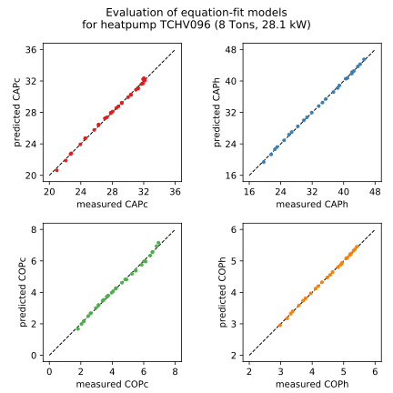

Heat Pump
==================

.. currentmodule:: pygld

.. autoclass:: pygld.HeatPump
   :no-members:
   :no-undoc-members:

Model and Data
---------------------------------

.. autoattribute:: pygld.HeatPump.hpdata
.. autoattribute:: pygld.HeatPump.model
.. automethod:: pygld.HeatPump.set_model

Heat carrier fluid properties
---------------------------------

.. autoattribute:: pygld.HeatPump.fluid
.. autoattribute:: pygld.HeatPump.fr

Heatpump independent properties
---------------------------------

.. autoattribute:: pygld.HeatPump.qbat
.. autoattribute:: pygld.HeatPump.TinHP
.. autoattribute:: pygld.HeatPump.Vf 

.. note::
    A numpy array will always be returned when getting
    :attr:`~pygld.HeatPump.qbat`, :attr:`~pygld.HeatPump.TinHP`, or
    :attr:`~pygld.HeatPump.Vf` independently of the format used to
    set the attribute.

Heatpump dependent properties
---------------------------------

.. autoattribute:: pygld.HeatPump.Tm
.. autoattribute:: pygld.HeatPump.ToutHP
.. autoattribute:: pygld.HeatPump.CAP
.. autoattribute:: pygld.HeatPump.COP

Utilities
---------------------------------

.. automethod:: pygld.HeatPump.in_table
.. automethod:: pygld.HeatPump.get_flowrange
.. automethod:: pygld.HeatPump.get_avail_fluid_types
.. automethod:: pygld.HeatPump.get_avail_heatpump_models
.. automethod:: pygld.HeatPump.print_avail_heatpump_models
.. automethod:: pygld.HeatPump.plot_heatpump_model_goodness

Example
---------------------------------

Import and instantiate the :class:`~pygld.HeatPump` class::

    >>> from pygld import HeatPump
    >>> heatpump = HeatPump()

Print the list of available heatpump models::

    >>> heatpump.print_avail_heatpump_models()
    0 - TCHV072 (6 Tons, 21.1 kW)
    1 - TCHV096 (8 Tons, 28.1 kW)
    2 - TCHV120 (10 Tons, 35.2 kW)
    3 - TCHV160 (13.3 Tons, 46.9 kW)
    4 - TCHV192 (16 Tons, 56.3 kW)
    5 - TCHV240 (20 Tons, 70.3 kW)
    6 - TCHV300 (25 Tons, 87.9 kW)
    7 - TMW360 (30 tons, 105.6 kW)
    8 - TMW600 (50 tons, 176 kW)
    9 - TMW840 (70 tons, 246 kW)

Print the list of available heat carrier fluids::

    >>> print(heatpump.get_avail_fluid_types())
    ['prop_glycol', 'ethyl_glycol', 'water']
    
Set the model of the heatpump::

    >>> heatpump.set_model(1)
    >>> print(heatpump.model)
    TCHV096 (8 Tons, 28.1 kW)
    
Set the values of the independent variables (:attr:`~pygld.HeatPump.qbat`,
:attr:`~pygld.HeatPump.TinHP`, :attr:`~pygld.HeatPump.Vf`) and the
properties of the heat carrier fluid (:attr:`~pygld.HeatPump.fluid` and
:attr:`~pygld.HeatPump.fr`)::

    >>> heatpump.qbat = [-16.5, 14.5]
    >>> heatpump.Vf = [1, 1]
    >>> heatpump.TinHP = [28, 0]
    >>> heatpump.fluid = 'prop_glycol'
    >>> heatpump._fr = 0.3

Get and print the resulting values of the dependent variables 
(:attr:`~pygld.HeatPump.TinHP`, :attr:`~pygld.HeatPump.Tm`, 
:attr:`~pygld.HeatPump.COP`, :attr:`~pygld.HeatPump.CAP`)::

    >>> print(heatpump.TinHP)
    [ 28.   0.]
    >>> print(heatpump.Tm)
    [ 30.49737498  -1.20748958]
    >>> print(heatpump.COP)
    [ 3.83293579  3.36205915]
    >>> print(heatpump.CAP)
    [ 28.20969661  22.99085714]

Or print `heatpump` to get a nicely formatted summary::

    >>> print(heatpump)
    model: TCHV096 (8 Tons, 28.1 kW)
    fluid: prop_glycol
    fr   : 0
    Vf (L/s): [ 1.  1.]
    qbat (kW): [-16.5  14.5]
    TinHP (°C): [ 28.   0.]
    ToutHP (°C): [ 32.99474997  -2.41497917]
    Tm (°C): [ 30.49737498  -1.20748958]
    COP : [ 3.83293579  3.36205915]
    CAP (kW): [ 28.20969661  22.99085714]

Check the goodness of fit of the models used to evaluate the 
:attr:`~pygld.HeatPump.COP` and :attr:`~pygld.HeatPump.CAP` of the heatpump::

    >>> heatpump.plot_heatpump_model_goodness()

